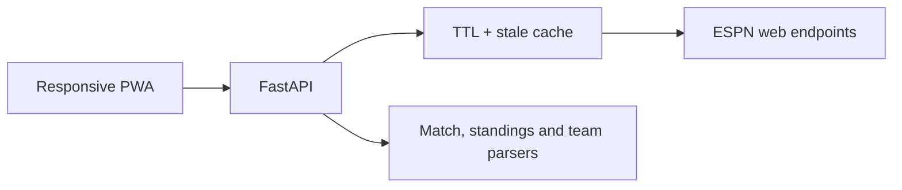

# CanlıSpor — Canlı Futbol Dashboard'u

CanlıSpor; farklı liglerdeki fikstürleri, canlı skorları, maç olaylarını, kadroları, istatistikleri ve puan durumunu tek ekranda sunan responsive bir futbol dashboard'udur. FastAPI backend, ESPN'in herkese açık web uç noktalarından aldığı veriyi normalize eder; framework kullanmayan frontend ise veriyi güvenli DOM işlemleriyle gösterir.

**[Canlı demoyu aç](https://canli-spor-ekrani.onrender.com/)**

## Öne çıkan özellikler

- 12 lig için canlı skor ve günlük fikstür
- Dün / bugün / yarın kısayolları ve takvimden tarih seçimi
- Takım logoları ve 15 saniyede bir otomatik yenileme
- Gol, penaltı, kendi kalesine gol, sarı/kırmızı kart ve oyuncu değişikliği timeline'ı
- Maç istatistikleri, resmi ilk 11'ler, diziliş, stadyum ve hakem bilgisi
- Lig puan durumu
- Sadece canlı maçları gösteren filtre
- Takım ve lig favorileri; favorilere özel maç filtresi
- Gerçek lig logolarıyla özel lig seçici
- Takım profili, lig derecesi, form, yaklaşan maçlar ve sezon kadrosu
- Sekmeli maç merkezi ve 15 gelişmiş takım istatistiği
- Tarih, lig ve maçı koruyan paylaşılabilir bağlantılar
- İsteğe bağlı canlı gol bildirimleri
- Telefona ve masaüstüne kurulabilen PWA desteği
- Masaüstü, tablet ve mobil ekranlara uyumlu tasarım
- Bağlantı yeniden kullanımı, otomatik tekrar deneme ve stale-cache geri dönüşü
- 15 saniyelik maç verisi ve 5 dakikalık puan durumu/takım cache'i
- API hata durumları, loading ekranları ve otomatik parser testleri
- GitHub Actions üzerinde Python ve JavaScript testleri

## Desteklenen ligler

Süper Lig, Premier League, La Liga, Serie A, Bundesliga, Ligue 1, Eredivisie, Liga Portugal, Suudi Pro Ligi, UEFA Şampiyonlar Ligi, UEFA Avrupa Ligi ve UEFA Konferans Ligi.

## Mimari

```text
canli-spor-ekrani/
├── app/
│   ├── main.py                 # FastAPI uygulaması
│   ├── config.py               # Lig ve takım adı eşlemeleri
│   ├── routes/
│   │   ├── fixtures.py         # Günlük fikstür
│   │   ├── matches.py          # Maç ayrıntısı
│   │   ├── standings.py        # Puan durumu
│   │   └── teams.py            # Takım profili, form ve kadro
│   ├── services/
│   │   └── espn.py             # HTTP istemcisi, cache ve veri parser'ları
│   └── utils/
│       └── formatting.py       # Türkiye saat dilimi ve tarih formatları
├── static/
│   ├── css/style.css
│   ├── js/app.js
│   ├── index.html
│   ├── manifest.webmanifest
│   └── sw.js
├── tests/
├── .github/workflows/ci.yml
├── Dockerfile
└── requirements.txt
```

Frontend → FastAPI → ESPN akışında dış veri doğrudan tarayıcıya aktarılmaz. Backend, takım taraflarını ID üzerinden eşleştirir, olayları standart bir modele dönüştürür ve kısa süreli bellekte önbelleğe alır.



## Yerel kurulum

Python 3.9 veya üzeri gereklidir.

```bash
git clone https://github.com/OzgurCgn/canli-spor-ekrani.git
cd canli-spor-ekrani
python -m venv .venv
```

Windows PowerShell:

```powershell
.venv\Scripts\Activate.ps1
pip install -r requirements.txt
python app.py
```

macOS / Linux:

```bash
source .venv/bin/activate
pip install -r requirements.txt
python app.py
```

Uygulama `http://127.0.0.1:8000` adresinde açılır. API dokümantasyonu `http://127.0.0.1:8000/docs` adresindedir.

## Docker ile çalıştırma

```bash
docker build -t canlispor .
docker run --rm -p 8000:8000 canlispor
```

## API uç noktaları

| Yöntem | Uç nokta | Açıklama |
|---|---|---|
| `GET` | `/api/fixtures?league=superlig&date=2026-09-01` | Seçilen günün maçları |
| `GET` | `/api/match-detail?event_id=...&league_slug=tur.1` | Olay, kadro ve istatistikler |
| `GET` | `/api/standings?league=superlig` | Lig puan durumu |
| `GET` | `/api/team-detail?team_id=432&league_slug=tur.1` | Takım profili, form, fikstür ve kadro |
| `GET` | `/api/health` | Sağlık kontrolü |

## Testler

```bash
pip install -r requirements-dev.txt
pytest -q
node --test tests/frontend.test.mjs
```

Testler; kendi kalesine golün doğru tarafa yazılmasını, takım ID eşlemesini, gelişmiş istatistikleri, takım profili parser'ını, paylaşılabilir URL durumunu, favorileri ve diziliş sırasını kontrol eder. Aynı kontroller her push ve pull request'te GitHub Actions tarafından çalıştırılır.

## Veri kaynağı notu

Bu proje eğitim ve portföy amacıyla geliştirilmiştir; ESPN ile bağlantılı veya ESPN tarafından desteklenen resmi bir ürün değildir. Dış veri kaynağının alanları ve erişilebilirliği zaman içinde değişebilir.

## Lisans

Bu proje [MIT Lisansı](LICENSE) ile sunulur.
